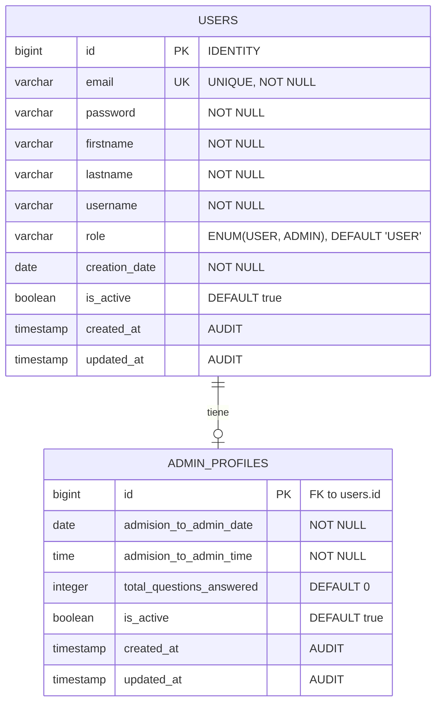

# Diagrama Entidad-Relación - Sistema de Autenticación

## Diagrama ER



## Descripción de las Entidades

### USERS (Tabla Principal)
- **id**: Clave primaria auto-incremental
- **email**: Email único del usuario (usado para login)
- **password**: Contraseña hasheada
- **firstname/lastname**: Nombre completo del usuario
- **username**: Nombre de usuario único
- **role**: Rol del usuario (USER o ADMIN)
- **creation_date**: Fecha de creación del usuario
- **is_active**: Estado activo/inactivo del usuario
- **created_at/updated_at**: Campos de auditoría automática

### ADMIN_PROFILES (Perfil de Administrador)
- **id**: Clave primaria que también es FK a users.id (relación 1:1)
- **admision_to_admin_date**: Fecha cuando se convirtió en admin
- **admision_to_admin_time**: Hora cuando se convirtió en admin
- **total_questions_answered**: Contador de preguntas respondidas
- **is_active**: Estado activo del perfil admin
- **created_at/updated_at**: Campos de auditoría automática

## Relaciones

1. **USERS ↔ ADMIN_PROFILES**: Relación uno a uno opcional
   - Un usuario puede tener o no un perfil de administrador
   - Un perfil de administrador pertenece a exactamente un usuario
   - La relación se establece cuando `role = 'ADMIN'`

## Scripts SQL para PostgreSQL

```sql
-- Crear enum para roles
CREATE TYPE user_role AS ENUM ('USER', 'ADMIN');

-- Tabla users
CREATE TABLE users (
    id BIGSERIAL PRIMARY KEY,
    email VARCHAR(255) NOT NULL UNIQUE,
    password VARCHAR(255) NOT NULL,
    firstname VARCHAR(100) NOT NULL,
    lastname VARCHAR(100) NOT NULL,
    username VARCHAR(100) NOT NULL,
    role user_role NOT NULL DEFAULT 'USER',
    creation_date DATE NOT NULL,
    is_active BOOLEAN NOT NULL DEFAULT true,
    created_at TIMESTAMP DEFAULT CURRENT_TIMESTAMP,
    updated_at TIMESTAMP DEFAULT CURRENT_TIMESTAMP
);

-- Tabla admin_profiles
CREATE TABLE admin_profiles (
    id BIGINT PRIMARY KEY REFERENCES users(id) ON DELETE CASCADE,
    admision_to_admin_date DATE NOT NULL,
    admision_to_admin_time TIME NOT NULL,
    total_questions_answered INTEGER NOT NULL DEFAULT 0,
    is_active BOOLEAN NOT NULL DEFAULT true,
    created_at TIMESTAMP DEFAULT CURRENT_TIMESTAMP,
    updated_at TIMESTAMP DEFAULT CURRENT_TIMESTAMP
);

-- Índices para optimización
CREATE INDEX idx_users_email ON users(email);
CREATE INDEX idx_users_role ON users(role);
CREATE INDEX idx_users_is_active ON users(is_active);
CREATE INDEX idx_admin_profiles_is_active ON admin_profiles(is_active);

-- Trigger para actualizar updated_at automáticamente
CREATE OR REPLACE FUNCTION update_updated_at_column()
RETURNS TRIGGER AS $$
BEGIN
    NEW.updated_at = CURRENT_TIMESTAMP;
    RETURN NEW;
END;
$$ language 'plpgsql';

CREATE TRIGGER update_users_updated_at BEFORE UPDATE ON users
    FOR EACH ROW EXECUTE FUNCTION update_updated_at_column();

CREATE TRIGGER update_admin_profiles_updated_at BEFORE UPDATE ON admin_profiles
    FOR EACH ROW EXECUTE FUNCTION update_updated_at_column();
```

## Consideraciones de Seguridad

1. **Password Hashing**: Usar BCrypt o similar para hashear contraseñas
2. **Validación de Email**: Validar formato de email antes de insertar
3. **Roles**: Implementar validación de roles en la aplicación
4. **Auditoría**: Los campos created_at/updated_at se manejan automáticamente
5. **Soft Delete**: Considerar implementar soft delete usando is_active
